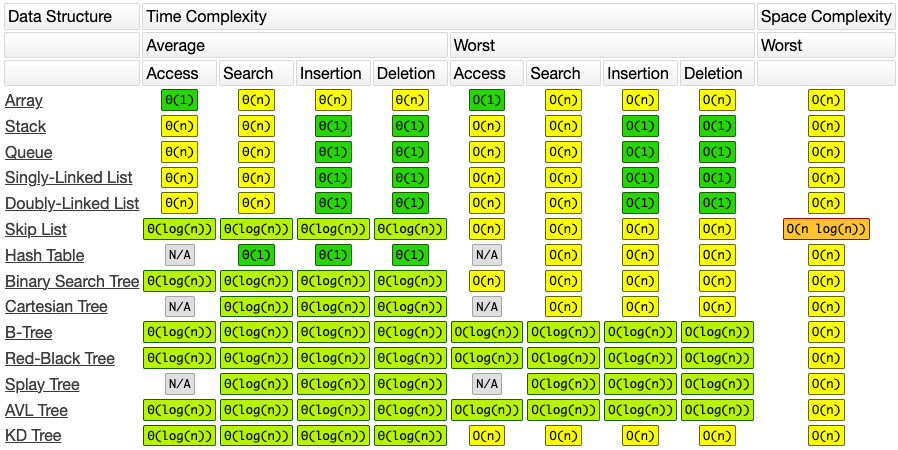
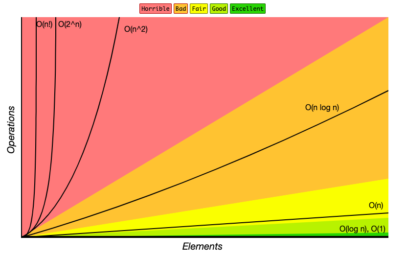
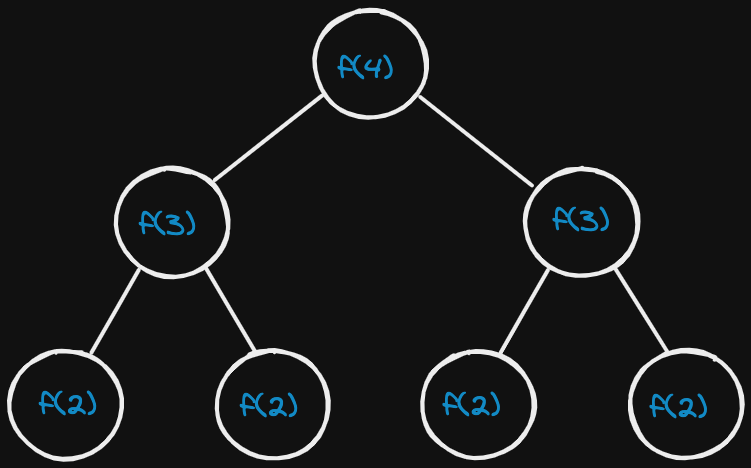

# Complexity Analysis & Big O



<p><small><i>Common Data Structure Operations - bigocheatsheet.com</i></small></p>

Sometimes, there are more than one way to solve a problem. We need to learn how to compare the performance different algorithms and choose the best one to solve a particular problem. While analysing an algorithm, we mostly consider time complexity and space complexity. Time complexity of an algorithm quantifies the amount of time taken by an algorithm to run as a function of the length of the input. Similarly, Space complexity of an algorithm quantifies the amount of space or memory taken by an algorithm to run as a function of the length of the input.

Time and space complexity depends on lots of things like hardware, operating system, processors, etc. However, we don't consider any of these factors while analysing the algorithm. We will only consider the execution time of an algorithm.

## Know Thy Complexities



<p><small><i>Big-O Complexity Chart - bigocheatsheet.com</i></small></p>

The following are examples of common complexities and their Big O notations, ordered from fastest to slowest:

- **Constant**: O(1)
- **Logarithmic**: O(log(n))
- **Linear**: O(n)
- **Log-linear**: O(n log(n))
- **Quadratic**: O(n^2)
- **Cubic**: O(n^3)
- **Exponential**: O(2^n)
- **Factorial**: O(n!)

```bash
O(1) < O(log n) < O(n) < O(n log n) < O(n^2) < O(2^n) < O(n!)

# if the value of n is large, (which it usually is, when we are considering Big O ie worst case), log n can be greater than 1
```

Note that in the context of coding interviews, Big O notation is usually understood to describe the worst-case complexity of an algorithm, even though the worst-case complexity might differ from the average-case complexity.

### O(N) - Constant time/space complexity

No matter how you change the input size, **the time it takes to get your output is the same**. With constant space complexity, the amount of memory you use doesn’t change as the input size grows. Examples:

- Basic Math Operators (+, -, *, /, %)
- Array Index Lookups (arr[5])
- Hash Map Get/Set Operations (map.get(“key”), map.set(“key”, “value”))
- Property Lookups (array.length, list.head, node.value…)
- Class Instantiations (let c = new Circle(radius = 5, colour = “blue”))

There are also a number of operations that typically fall in this category if implemented most efficiently. Usually, they boil down to doing one or
more of the previously mentioned operations, like instantiating an
object or looking up some property.

Some examples include:

- **Linked List** append(), prepend(), head(), tail()
- **Stack** push(), pop(), peek()
- **Queue** enqueue(), dequeue()
- **Binary Tree Node** getleftChild(), getrightChild()
- **Graph Node** getAdjacentNodes(node), connectNodes(node1, node2)
- Accessing a memory slot is a very basic operation that takes constant time. For example, Accessing a value in an array at a given index → `array[34]`

:::note
The thing all these operations have in common is they pretty much just do **one thing**, taking **one step**, or performing **one action**.
:::

A lot of engineers get tripped up by `O(1) space` lol, but all this means **the amount of memory you use _doesn’t scale_ 💡 with the input size**.

### O(squareroot N) time

...

### Logarithmic

A mathematical concept that's widely used in Computer Science and that's defined by the following equation: `log b(x) = y` if and only if `b^y = x`

In the context of coding interviews, the logarithm is used to describe the complexity analysis of algorithms, and its usage always implies a **logarithm of base 2**. In other words, the logarithm used in the context of coding interviews is defined by the following equation: `log(x) = y` means `2^y = x`

:::note

`log(x) = y` means `2^y = x`

:::

In plain English, if an algorithm has a logarithmic time complexity **`O(log(n)`**, where `n` is the size of the input), then **whenever the algorithm's input doubles in size** (i.e., whenever **n** doubles), **the number of operations needed to complete the algorithm only increases by one unit**. Conversely, an algorithm with a linear time complexity would see its number of operations double if its input size doubled.

As an example, a linear-time-complexity algorithm with an input of size 1,000 might take roughly 1,000 operations to complete, whereas a logarithmic-time-complexity algorithm with the same input would take roughly 10 operations to complete, since **210 ~= 1,000**.

### O(A.B)

Two loops but on different arrays O(A.B) instead of O(N^2).

```python
def foo(array_a, array_b):
    for a in array_a:
        for b in array_b:
            print(a, b)
```

For each element of array `array_a`, the inner loop goes through `B` iterations where `B` is the length of `array_b`. So if `A` is the total number of elements in `array_a`,
the total number of operations is `A * B`.

### O(N^2) - Quadratic

`(N-1) + (N-2) + (N-3) + ... + 2 + 1  ~=  N^2`

:::note
Quadratic: `(N-1) + (N-2) + (N-3) + ... + 2 + 1  ~=  N^2`

Not Quadratic: `N * (N-1) * (N-2) * (N-3) * ... * 2 * 1  ==  N!`
:::note

### O(2^N) - Exponential

If n is the size of the input, then **whenever the algorithm's input increases in size** (i.e., n+1), **the number of operations needed to complete the algorithm doubles**, the algorithm is said to have an exponential time complexity.



<p><small><i>Recursive call tree similar to what happens in a fibonacci recursive function.</i></small></p>

The tree will have a depth of `N`. Each node (each function call) has two children. Therefore, each level will have **double** the children as the one above.
Therefore, there will be `2^0 + 2^1 + 2^2 + ... + 2^N` children, which is `2^(N+1) - 1` children (sum of powers of 2). Which is roughly `O(2^N)` nodes (children).

### O(N!) - Factorial

The **factorial function** (symbol: **!**) says to **multiply all whole numbers** from our chosen number down to 1. [Factorial - Wikipedia](https://en.wikipedia.org/wiki/Factorial).

`N * (N-1) * (N-2) * (N-3) * ... * 2 * 1  ==  N!`

Examples:

```txt
4! = 4 × 3 × 2 × 1 = 24

7! = 7 × 6 × 5 × 4 × 3 × 2 × 1 = 5040

1! = 1
```

:::note
Factorial: `N * (N-1) * (N-2) * (N-3) * ... * 2 * 1  ==  N!`

Not factorial: `(N-1) + (N-2) + (N-3) + ... + 2 + 1  ~=  N^2`
:::note

### Bonus 1: A wrinkle **(fixed, finite upper limit)**

Suppose you wanted to write a function that counted all the frequencies of characters in a string. A really simple (and efficient) way to do it would be to loop through all of the string’s characters and then tally them up in a hash map:

The **runtime** of this function depends on the length of the string. 1 more character, means 1 more step, so the runtime is **`O(N)`**.

But what about **space complexity**? We’re using a few variables, but the obvious one that seems to scale up with the size of the string is the `counts` hashmap. The more characters you have, the more it seems **like you’ll have to keep track of, so it might seem like it’s also `O(N)`**.

But the reality is that it’s actually **O(1)** 🤯 because you are only dealing with a **finite character set.** Sometimes see this big-O notation written as **`O(C)`**. It’s used to express the fact that constant time/space isn’t just limited to one step or one unit of memory usage. There can be some amount of scaling up in runtime or memory usage, as long as it’s to some **fixed, finite upper limit**.

### Bonus 2: An algorithm that took in an array of strings, sorted each string and then sorted the full array

To sort each individual string in the array, we would start by looping through the whole array, sorting each string element, and either replacing the strings in the original array with their sorted versions, or building a new array with the sorted strings.

Then, to sort the whole array, we would perform some sorting function on it.

```python
def sort_array_of_strings(array_of_strings):
    sorted_strings = []
    for string in array_of_strings:
        sorted_strings.append(sorted(string))
    sorted_strings.sort()
    return sorted_strings
```

In the first step of our algorithm, we sort each string in the array. We have to loop through every element in the array (let's call it's length "a"); then at each step we have to sort a string (let's call the length of the longest string "s"). The best sorting algorithms have a time complexity of `s * log(s)`. And since we have to do that "a" times, that gives us `O(a * s * log(s))` for the first step.

For the second step, we have to apply sorting to the array, giving us another `a * log(a)`, but for each of those steps, we have to compare two strings, which is itself a `O(s)` operation. So that gives us a total of `O(s * a * log(a))` for that step.

Since we do these steps consecutively, we add their time complexities together, getting `O(a * s * log(s) + s * a * log(a))`, which can also be written as `O(s * a * (log(s) + log(a))`.

### Bonus 3: Graph DFS & BFS

[Depth First Search or DFS for a Graph - GeeksforGeeks](https://www.geeksforgeeks.org/depth-first-search-or-dfs-for-a-graph/)

The time complexity of DFS & BFS if the entire tree is traversed is `O(V)` where V is the number of nodes. In the case of a **graph**, the time complexity is where V is the number of vertexes and E is the number of edges.

> The **Time complexity of BFS** is `O(V+E)` when **Adjacency List** is used and `O(V^2)` when **Adjacency Matrix** is used, where V stands for vertices and E stands for edges.
>

## Important rules to know with `Big O`

### 1. Different steps get added

```python
# O(a+b)
def do_something():
    do_step_one() # O(a)
    do_step_two() # O(b)
```

### 2. Drop constants

```python
# O(2n) => O(n)
```

### 3. Different inputs ⇒ Different variables

When calculating th big O for different inputs, we use different variables.

```python
# O(a.b)
def random(array_a, array_b):
    ...
```

### 4. Drop non-dominant terms

We drop `O(n)` below because it is not the dominant term.

```python
# O(n^2)
def do_something(array):
    do_step_one(array) # O(n)
    do_step_two(array) # O(n^2)
```

### 5. Multi-Part Algorithms: Add vs. Multiply

In general:

If your algorithm is in the form _"do this, then, when you're all done, do that"_ then you add the run times.

If your algorithm is in the form _"do this for each time you do that"_ then you multiply the run times.

### 6. Recursive Run times

Try to remember this pattern. When you have a recursive function that makes multiple calls, the runtime will often (but not always) look like `O( branches ^ depth )`, where branches is the number of times each recursive call branches.

:::note

When you have a recursive function that makes multiple calls, the runtime will often (but not always) look like `O( branches ^ depth )`

:::

Example:


How many calls are in this tree?

The tree will have a depth of `N`. Each node (each function call) has two children. Therefore, each level will have double the calls as thee one above.
Therefore, there will be `2^0 + 2^1 + 2^2 + ... + 2^N` calls, which is `2^(N+1) - 1` calls (sum of powers of 2). Which is `~= O(2^N)`, `O( branches ^ depth )`.

Also, note that the space complexity of a recursive function is `O(depth)`. Although we have `O(branches^depth)` (`O(2^N`)calls, we only ever have `O(depth)` (`O(N)`)calls on the call stack at once (at any given time). We would therefore need to have `O(depth)` memory available to store all of those function calls.

:::note

When you have a recursive function, the memory will look like `O(depth)`

:::
